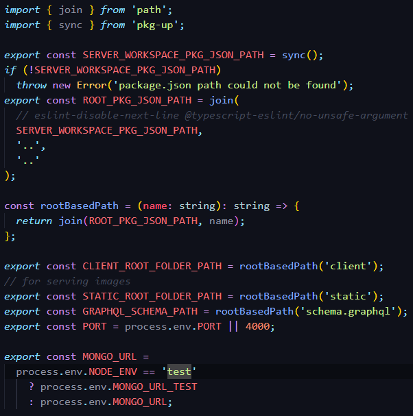
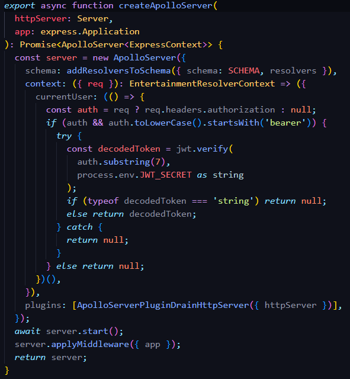
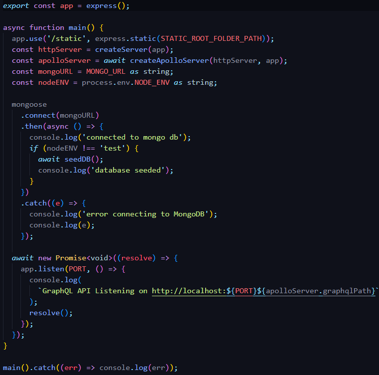

# Entertainment App

<!-- image here -->

Project provided by [FrontEndMentors](https://www.frontendmentor.io/challenges/entertainment-web-app-J-UhgAW1X). Desing and main requirement provided thanks to FrontEndMentor.

The requirement of the project is to create a simple entertainment app where a user can navigate through TV shows, movies, bookmarked, or all content. The project initial requirement is to just create the interface, but as a bonus, I decided to creata a full-stack application that aims to achieve the following:

1. **Authentication**, user creates account and can only interact with the backend if they have the verified credentials
2. **Database modification**, user is able to bookmark content, remove bookmarked content, and have those changes reflect on the user-interface and in the backend.
3. **Front/backend testing**, testing for the entire application. I want to be able to safely say that the application will run properly after it has successfully passed all test created for it.

<!-- Link to live application here -->

## Techstack Used

This section contains information about the technology used for both the front-end and backend, using [ESlint](https://eslint.org/), one general ESLint file was created which contained rules targeting the frontend and backend portions of the application.

### Frontend

Project was bootstrapped with [Vite](https://vitejs.dev/guide/) using the the React/Typescript template.

- [React](https://reactjs.org/docs/getting-started.html) (Front end framework/library)
- [Cypress](https://docs.cypress.io/guides/overview/why-cypress) (End-to-end testing)
- [Apollo Client](https://www.apollographql.com/docs/react/) (State management for GraphQL)
- [Formik](https://formik.org/) (State management for Forms)
- [Styled Components](https://styled-components.com/)
- [React Router](https://reactrouter.com/en/main) (Client side routing)

Other packages installed include [yup](https://www.npmjs.com/package/yup) and [validator](https://www.npmjs.com/package/validator) to assist Formik with form validation for the Login and Sign Up forms.

### Backend

- [Apollo Server](https://www.apollographql.com/docs/apollo-server) (GraphQL Server)
- [MongoDB](https://www.mongodb.com/) (NoSQL Database)
- [Mongoose](https://mongoosejs.com/docs/) (Schema connection with MongoDB)
- [supertest](https://www.npmjs.com/package/supertest) (HTTP testing for GraphQL server)

Authentication was handled with [JSON Web tokens](https://www.npmjs.com/package/jsonwebtoken), with [bcrypt](https://www.npmjs.com/package/bcrypt) being used to hash passwords.

I chose GraphQL as the server because it was easier to structure and grab data from a query or mutation. Since I was using TypeScript, the [graphql codegen tool](https://the-guild.dev/graphql/codegen) allowed me to create my schema's into one file, run the codegen command, and get all of the type information for my queries and mutations. MongoDB was chosen because it is the database program that I am most familiar with, along with using Mongoose to create the schemas.

### Docker

- [Docker Desktop](https://www.docker.com/products/docker-desktop/)
- [Docker Compose](https://docs.docker.com/compose/)

Before starting this project, I had just learned about Docker basics and its benefits to frontend/backend development. Two simple Docker Compose files were created that initalize a database in a virtual environment that can be accessed by the application. One for a developer environment, the other for a test environemnt (does not initialize data on build, and allows for the use of a reset query for the entire database). A mongo initalize Javascript file is used to create the database in the virtual environment

## Launching the application Locally

**For Windows Devices**, you must install [Windows Subsystem for Linux (WSL)](https://learn.microsoft.com/en-us/windows/wsl/install) on your device, which allows developers to install a Linux distribution and use Linux applications, utitlies, and Bash command-line tools diretly on Windows.

Please follow the link to download [Docker Desktop](https://docs.docker.com/get-docker/), which is must be running on your device when you wish to start a docker container. Once you have Docker Desktop installed, you will be able to run docker compose files without any other configuration. Please see the Docker section above for a link to the Docker Compose page.

### Starting the Development Environment

Please follow the instructions below to run the developer environment on your machine.

Note: **_Ensure Docker Desktop is running, containters will not start unless Docker Desktop is running._**

1. Run the command `npm run docker:mongo:dev`, this will create the docker container for MongoDB database to run.
2. Run the command `npm run start:server:dev`, this starts the server in developer mode. The server is listening on Port 4000.
3. Run the command `npm run start:client:dev`, this starts the client in developer mode, using vite, any changes made to the client-side code will immediately reflect on the page (if no errors).

Any change/save made on the server will automatically cause a rebuild of the application.
When closing the application run the command `npm run docker:mongo:dev:down` to stop and delete the development container, or else the container will keep running, and your device will be wasting memory.

### Starting the Testing Environment

1. Run the command `npm run docker:mongo:test`, this will create the docker container for MongoDB database to run.
2. Run the command `npm run start:server:test`, this starts the server in developer mode. The server is listening on Port 4000.
3. Run the command `npm run start:client:dev`, this starts the client in developer mode, using vite, any changes made to the client-side code will immediately reflect on the page (if no errors).

The testing environment does not automatically seed the database with information, the seeding is only done while test are running.
In the server, the query 'resetDatabase' can **only be run while in the testing environment**.

To run test for the client/server, please run the following

- `npm run test:client:e2e` launches cypress, which allows you to see the various test files created and run them.
- `npm run test:backend` launches jest, and runs the test in the `__test__` directory.

## Development

This section will cover my development progress as I created the application, along with the issues I encountered and my solutions to them.

### Backend

This was my first time creating my own backend service, however, thanks to [Fullstack TypeScript](https://frontendmasters.com/courses/fullstack-typescript/) course provided by [FrontEndMasters](https://frontendmasters.com/), I was able to find a good starting point to begin the process. I had knowledge of both TypeScript and GraphQL, but didnt't have the experience putting it all togther. This course really helped me start this project and help make it what it is today.

#### Server Configuration/Constants

To make it easier on myself and when I deploy the application, I set up constant variables that can be accessed throught the application that provide the following information:

- Path for client code
- Path to static folder
- Path to the GraphQL Schema
- Port for the GraphQL server
- The MongoDB URL to use.

This makes it so I don't have to type this information manually wherever it is needed.

#### Creating the server

The GraphQL server is created along with express, and acts as more of a middlware for the application. The GraphQL Schema file is located in the root directory query and mutation information for the server. The path to the schema is provided to the apollo server thanks to the constant variable created in the `constants.ts` file, as seen above. A file named `resolvers.ts` contains an object with the resolver information, this is imported into this file and injected into the apollo server arguments, more specifically, using the `addResolversToSchema` method.

The apollo server initalizes a context whose sole purpose is to extract a possible JWT token, decode the token, and return the decoded data as `currentUser` in every resolver. It checks for a authorization header, and there is a valid authorizatio head it attempts to decode a token, else it skips this step. If it doesnt find a token then an error does not occur because checking for a valid token will not occur until we get to the resolver being called. More on this later.

The only plugin provided is the [`ApolloServerPluginDrainHttpServer`](https://www.apollographql.com/docs/apollo-server/api/plugin/drain-http-server/) plugin, ensures the server shuts down gracefully. At the end we start the server, apply the express app as a middleware, and return the server. We are attaching an apollo server to an express server.

### Intializing the Server

The ``main`` function intializes the server by doing the following:
1. create a path to the static folder whcih will contain images to be used by the application.
2. Use the ``createApolloServer`` function from above with an HTTP server passsed in along with the express application created above the main function.
3. Grab the Mongo URL and Node environment from the ``constants.ts``.
4. Connect to the MongoDB database, if it fails we log an error, else we check to see if we are in the test environment, if we are not then we seed the database. 
5. Have the app listen to the PORT provied by ``constants.ts``

If you are on a local machine, you can now go to ``localhost:4000/graphql`` to view the GraphQL playground and make queries/mutations to the server.
